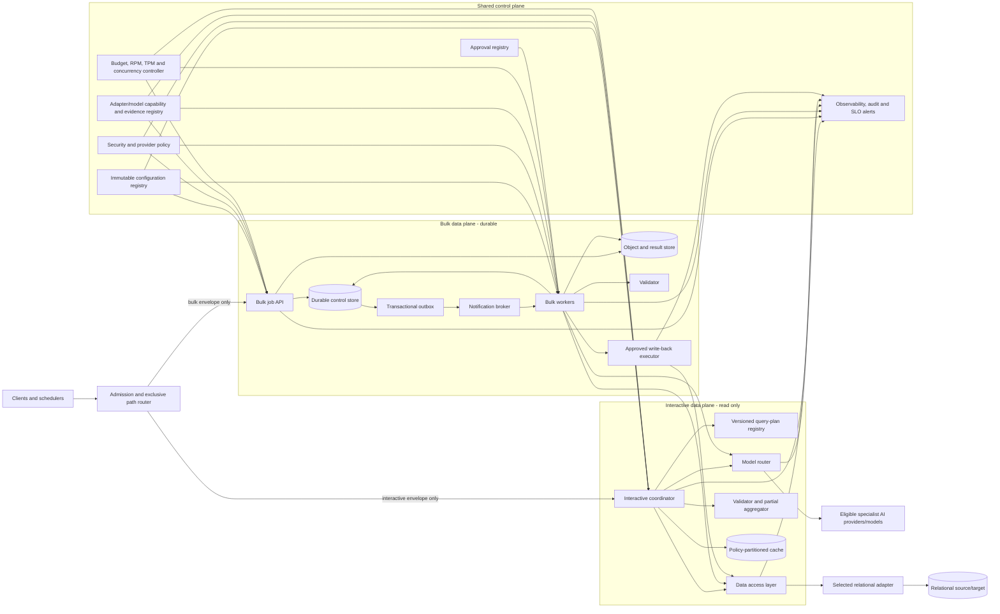
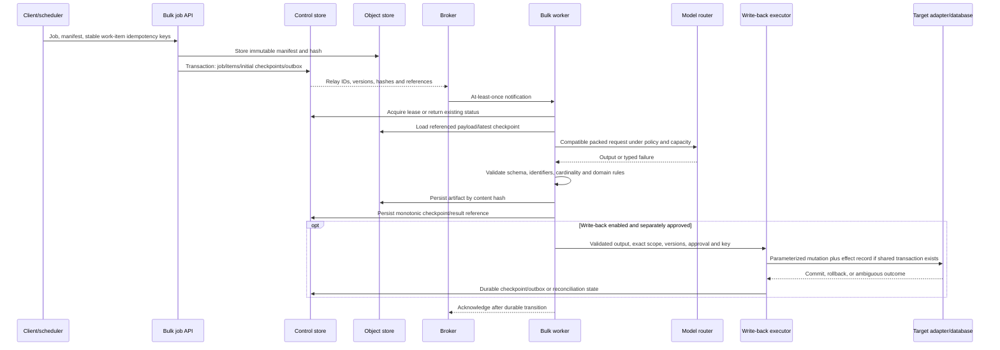

# Database-Agnostic AI Retrieval and Task Processing Architecture

**Status:** Architecture proposal  
**Audience:** Application, platform, data, security, FinOps, and operations teams  
**Scope:** Relational retrieval plus task-specific AI inference for synchronous interactive requests and asynchronous bulk jobs

## Executive summary

This proposal defines one system with two **mutually exclusive data paths** and one shared control plane:

1. A synchronous, read-only **interactive path** optimized for an observed end-to-end p95 below 2 seconds and a hard per-request response deadline.
2. An asynchronous **bulk path** optimized for throughput, durable recovery, work-item isolation, and optional, separately approved write-back.
3. A **shared control plane** for immutable configuration, policy, adapter evidence, model routing, budgets, capacity, approvals, telemetry, and audit.

The design is database-agnostic only within an explicit vendor-neutral relational contract. Database adapters must prove conformance for normalized values, types, nulls, ordering, errors, and transaction outcomes. The interactive path is structurally read-only: it uses a read-only identity, exposes no mutation interface, and blocks mutation before adapter submission. Batch write-back is a separate capability requiring deterministic validation and an exact, current approval match immediately before mutation.

The architecture supports task-specific operations such as extraction, classification, translation, summarization, masking, sentiment, similarity, document processing, and—through distinct capability contracts—forecasting or driver analysis. It does not assume one generative model is appropriate for every task.

## Candid verdict on the original draft

The original draft is a useful **bulk-pipeline sketch**, not a sufficient production architecture and not an interactive retrieval design.

### Ideas worth retaining

- **Context-aware packing:** group compatible items to amortize request, prompt, and network overhead.
- **Bounded fan-out:** parallelize independent work without an unbounded request storm.
- **Economical routing:** try the lowest-cost eligible specialist first, with policy-controlled fallback.
- **Validation before acceptance:** enforce schema, identifiers, and cardinality rather than trusting model output.
- **Failure isolation and fan-in:** preserve valid item outcomes when peers fail.
- **Checkpointing and DLQ handling:** make bulk work resumable and operationally repairable.
- **Bulk persistence:** avoid row-at-a-time writes for validated output where adapters support set-oriented operations.

### What must change

Airflow can schedule or monitor a coarse-grained bulk job, but it should not be the request runtime, item-state authority, queue, or payload bus. XCom is not appropriate for large manifests and model results, couples recovery to one orchestrator, and cannot serve the interactive latency path. Likewise, a `processing_queue` in the source database couples orchestration to a vendor and workload schema, creates contention with operational data, and conflates source data, durable workflow state, and message delivery.
The replacement is a small durable control store for jobs, items, attempts, leases, checkpoints, effects, outbox events, and budget state; object storage for immutable manifests and large artifacts; and a broker carrying only wake-up notifications with identifiers, versions, hashes, and references. Broker delivery is at least once. Correctness comes from leases, checkpoints, idempotency keys, transactional outbox/effect patterns, and target verification.

The original draft also overstates several guarantees:

| Original implication | Correct statement |
|---|---|
| A concurrency pool mathematically prevents provider 429s | Concurrency bounds reduce pressure but cannot guarantee no 429s. Providers also enforce RPM/TPM windows, may share quotas with other clients, and can throttle independently. Use concurrency limits, request/token buckets, feedback, circuit breakers, and bounded retries. |
| A schema parser guarantees correct output | Schema validation proves shape, types, and declared deterministic rules—not factual truth. Semantic checks, evidence, thresholds, review, and measured quality remain necessary. |
| Only 5–10% of items require the expensive model | Fallback rate is empirical and depends on task, data, prompts, model/version, validation rules, and drift. Measure it and budget conservatively. |
| Queue retention means no row is processed twice | At-least-once delivery can repeat execution. Stable idempotency keys and committed effect records can provide one logical mutation outcome under defined conditions. |
| The pipeline achieves the exact same goals as Databricks AI functions | It may reproduce selected task behavior and controls, but not automatically Databricks' full managed model portfolio, research maintenance, SQL/Spark integration, governance, optimizer, reliability, support, or economics. Benchmark each task and total cost of ownership. |

## Goals, non-goals, and guarantees

### Goals

- Offer low-latency, read-only AI-assisted relational retrieval.
- Process large datasets asynchronously with bounded cost and recoverable progress.
- Replace relational vendors through tested adapters without changing behavior inside the declared contract.
- Route to the cheapest model that satisfies capability, security, quality, budget, capacity, and deadline requirements.
- Prevent unapproved model output from reaching downstream effects.
- Make execution reproducible through immutable configuration and correlated evidence.

### Non-goals

- Arbitrary model-generated SQL or unrestricted database access.
- Factual guarantees from probabilistic model output.
- Exactly-once message delivery or physical execution.
- Full replication of a managed lakehouse, model platform, or every Databricks AI function.
- Production readiness based only on a prototype or timeout setting.

### Claim boundaries

The system guarantees deterministic behavior only for logic under its control: exclusive routing, immutable version binding, capability gates, validation rules, budget transitions, state classification, and approval equality. External SLOs, model quality, provider availability, database performance, and costs require measurement in the target environment. The p95 objective is an observed service-level objective; the hard deadline guarantees a complete or explicit fallback response, not complete work for every request.

## Architecture



Admission accepts an explicitly typed interactive request or bulk job. If conflicting indicators cannot be resolved by the configured discriminator, it rejects the envelope **before** database or model activity. Every accepted execution receives a globally unique correlation ID and an immutable configuration snapshot. Changes to the active profile never alter an in-flight execution; every result, checkpoint, effect, telemetry event, and audit record carries the bound version.

### Component responsibilities

| Component | Owns | Does not own |
|---|---|---|
| Admission/path router | Envelope validation, exclusive path selection, correlation ID, immutable configuration binding | Payload-size guessing after acceptance; database/model execution |
| Interactive coordinator | One absolute deadline, bounded operation graph, cancellation, exactly one complete/fallback response | Mutation, durable batch orchestration, unbounded retries |
| Bulk job API/coordinator | Manifest validation, stable keys, durable initial state/outbox, cancellation and terminal job reporting | Large payload transport in messages |
| Query-plan registry | Reviewed versioned plan IDs, typed parameters, datasets, ordering, row/byte limits, capability declarations | Free-form executable model SQL |
| Data access layer (DAL) | Operation classification, parameter binding, capability checks, read-only enforcement, adapter calls, normalized outcomes | Vendor-specific behavior outside the contract |
| Adapter/evidence registry | Contract versions and complete conformance evidence before adapter activation | Universal equivalence across all relational features |
| Model router | Eligibility filtering, deterministic economical selection, fair scheduling, retry/fallback transitions | Bypassing policy, budget, capacity, quality, or deadline gates |
| Budget/rate controller | Atomic multi-scope cost/token reservation and reconciliation; RPM/TPM/concurrency admission | Treating estimates as actual usage; promising no throttling |
| Validators | Parse/schema, identifier set, cardinality, deterministic domain rules, digests, semantic thresholds/evidence | Guaranteeing factual truth |
| Partial aggregator | Merge accepted results, identify exact omissions/reasons, suppress late outcomes | Waiting past the terminal deadline |
| Control store | Jobs, items, attempts, leases, checkpoints, effects, outbox, DLQ indexes, ledger | Large source/result bodies |
| Object/result store | Immutable manifests, permitted snapshots, model artifacts, validated results, hashes | Mutable job state or queue semantics |
| Write-back executor | Current policy/approval validation, parameterized mutation, idempotent effect/reconciliation | Interactive access or mutation without exact approval |
| Observability/audit | Correlated redacted metrics, logs, traces, decision audits, p95 windows and alerts | Raw sensitive data in ordinary telemetry |

## Vendor-neutral data boundary

The DAL accepts typed operations defined by a versioned relational contract. That contract specifies normalized scalar, decimal, temporal, timezone, binary, and null representations; collation assumptions; pagination; deterministic ordering; affected-row semantics; typed failures; isolation; commit; and rollback outcomes. Unsupported operations or semantics fail before adapter submission.

Results without intrinsic order require an explicit stable ordering before they can be returned as ordered or compared across adapters. Adapter activation requires the same versioned contract suite to pass for normalized types/nulls, ordering, failures, affected rows, commit, and rollback. Evidence records the adapter version, suite version, tested cases, outcomes, and timestamp. Portability means equivalence **inside this tested contract**, not identical plans, performance, extensions, or administration across vendors.

Interactive operations use an identity whose effective authorization—including inherited roles and callable routines—is verified as retrieval-only. Plans are statically classified, parameterized, allowlisted, bounded, and run in read-only mode. A detected or indeterminate mutation remains blocked and produces a redacted security audit event.

## Interactive path

```mermaid
sequenceDiagram
  participant U as Caller
  participant R as Admission router
  participant I as Interactive coordinator
  participant P as Policy/budget/rate control
  participant D as DAL with read-only identity
  participant M as Model router
  participant V as Validator/aggregator

  U->>R: Typed interactive request, plan ID, parameters
  R->>R: Resolve one path; bind config, correlation ID and absolute deadline
  R->>I: Immutable execution context
  I->>P: Authenticate; authorize; classify/mask; reserve capacity
  P-->>I: Allow plus reservation, or typed rejection
  I->>D: Allowlisted read with same deadline
  D-->>I: Normalized deterministically ordered rows or typed failure
  I->>M: Compatible specialist tasks with remaining time
  par Bounded useful fan-out
    M-->>V: Result or typed failure
    M-->>V: Result or typed failure
  end
  V->>V: Deterministic validation and partial aggregation
  V-->>I: Complete result or exact incompleteness metadata
  I-->>U: Exactly one terminal response by deadline
  I->>D: Cancel unfinished reads
  I->>M: Cancel unfinished calls; suppress late outcomes
```

1. Admission authenticates the caller, resolves exactly one path, binds immutable configuration, assigns correlation, and calculates `deadline = accepted_at + configured_duration`.
2. The caller chooses a reviewed query plan and typed parameters. If natural-language plan mapping is offered, the model may select only an allowlisted plan ID and parameters; ambiguity or failed authorization falls back or asks for refinement.
3. Security classification, authorization, masking, provider residency/routing, and encryption decisions occur before protected data crosses an external boundary. Missing, invalid, unavailable, denied, or indeterminate policy fails closed.
4. The DAL checks capabilities, deterministic order, row/byte limits, and read-only classification before adapter submission.
5. Model work is fan-out only when specialists are independently useful. Eligibility requires capability, data/provider policy, quality floor, atomic budget availability, RPM/TPM/concurrency capacity, and predicted completion before the shared deadline.
6. Selection is deterministic: estimated cost ascending, configured priority descending, then stable model ID. Retry/fallback is allowed only for configured retryable or validation failures and only while attempt, delay, budget, and deadline gates pass.
7. Validation uses the bound rules version. Multi-item output must have the exact unique identifier set and cardinality. Invalid portions are withheld.
8. The coordinator reserves response time, emits exactly one complete or fallback response no later than the deadline, names every omitted/incomplete operation and reason, initiates cancellation, suppresses late outcomes, and records them.

The interactive dependency graph contains no write credential and no mutation method. Read-only enforcement exists at configuration validation, code/interface, plan classification, transaction, and database authorization layers.

## Bulk path



1. The API rejects any work item without a stable idempotency key before model execution or write-back. It stores large manifests in object storage and atomically creates control records plus outbox events.
2. The relay may publish more than once. A worker claims a bounded lease only after durable in-progress state exists. Duplicate active claims return the existing status.
3. Workers resume from the latest monotonic checkpoint. Packing requires compatible task, capability, security/provider policy, validation/configuration version, and deadline class. Packs are capped by items, estimated input/output tokens, request bytes, provider limits, and failure-isolation strategy.
4. Each item retains independent attempts and terminal state. A malformed pack can be bisected; one item failure never changes peer outcomes or prevents eligible peers from continuing.
5. Artifacts are stored before the corresponding durable checkpoint advances. Broker acknowledgement follows the durable transition, so crashes lead to redelivery and resume rather than assumed completion.
6. Retry exhaustion yields the `retry-exhausted` terminal item state and DLQ persistence. Other terminal states are excluded from the DLQ. If DLQ storage fails, the terminal state remains and a persistence-repair alert is emitted.
7. Terminal item states are exactly: `succeeded`, `validation-failed`, `policy-rejected`, `budget-exhausted`, `retry-exhausted`, `write-back-failed`, or `cancelled`. The terminal report partitions every item exactly once by state.
8. Job classification is deterministic: all success → `succeeded`; mixed success/non-success → `partially-succeeded`; no success plus budget cause → `budget-exhausted`; no success plus cancellation cause → `cancelled`; otherwise → `failed`.

### Write-back boundary

Validated bulk output is persisted without mutation when write-back is disabled. When enabled, the executor re-evaluates security and verifies exact equality of job ID, item/data scope, target dataset, row scope, columns, mutation type, validation-rules version, configuration version, policy version, and current approval validity. Missing, unequal, expired, or revoked approval blocks adapter submission.

The preferred effect design writes the target mutation and an effect record in one target transaction, with a unique idempotency constraint. A repeated key returns the committed outcome. If target and effect state cannot share a transaction, the target must expose a uniquely constrained key or effect ledger. Before retry, the executor verifies the idempotency key and mutation digest. An ambiguous commit goes to reconciliation; it is never blindly replayed. A committed effect with a missing checkpoint reconstructs that checkpoint without repeating mutation. Pre-commit failure rolls back all changes and records `write-back-failed`.

This provides one **logical mutation outcome** per key under the stated target/effect protocol. It does not provide exactly-once message delivery or guarantee that remote code was invoked only once.

## Validation and cache safety

Passing validation means “meets the deterministic, versioned acceptance rules,” not “is true.” Rules cover parseability, schema, types, ranges, identifier-set equality, cardinality, duplicates, permitted labels, evidence references, referential constraints, and mutation scope. Probabilistic semantic scores use explicit thresholds or human review. Validation stores its rules version, outcome, failed rule IDs, and canonical input/output identifier digests. If metadata storage alone fails after validation passed, downstream processing may continue while telemetry reports the metadata failure; invalid output never does.

Caching is optional and partitioned by tenant/security context. A key includes canonical input/parameters, plan/data snapshot, task, model/provider, prompt/template, security, validation and configuration versions. Authorization is rechecked on every hit. Sensitive entries use policy-mandated encryption and TTL; prohibited classes are never cached. Invalid, cancelled, late, or ambiguous output is not cached as complete. Write-back always rechecks validation, approval, and effect state regardless of cache.

## Latency objective and deadline budget

The service objective is p95 end-to-end interactive latency **below 2,000 ms** for each configured measurement window. p95 uses nearest rank: sort positive completed latencies and select rank `ceil(0.95 × n)`. If p95 is at least 2,000 ms, emit one alert with window bounds, sample count, p95, and contributing stage durations.

A representative 1,900 ms internal budget leaves 100 ms for external transport/jitter:

| Stage | Target | Control |
|---|---:|---|
| Admission, auth, config/correlation binding | 60 ms | Reject ambiguity and policy failure early |
| Plan resolution and authorized cache lookup | 40 ms | Local/versioned lookup |
| Relational retrieval | 300 ms | Bounded rows/bytes, indexed plans, warm pool/read replica where suitable |
| Classification, masking, model preparation | 80 ms | Includes token estimate |
| Primary specialist work | 900 ms | Parallel critical path, normally 1–3 specialists—not summed |
| Optional retry/fallback reserve | 250 ms | Start only if predicted completion fits |
| Validation and partial aggregation | 120 ms | Early/streaming deterministic checks where possible |
| Serialization and terminal emission | 50 ms | Reserved from retry consumption |
| Cancellation initiation and telemetry enqueue | 100 ms | Non-blocking after terminal decision |
| **Internal total** | **1,900 ms** | **100 ms safety margin to 2,000 ms** |

Every stage receives the same absolute deadline and computes `timeout = min(component_cap, remaining - downstream_reserve)`. Admission can shed load, reduce fan-out, select an authorized cache path, or return fallback before starting work. Deadline code alone cannot prove the p95 objective; representative load tests, warm dependencies, queue isolation, capacity models, and production SLO telemetry are required.

## Cost and capacity model

For model `m` and task/pack `p`, estimate fixed-point monetary cost as:

`C(m,p) = Tin × Pin(m) + Tout × Pout(m) + Crequest(m) + Ctransfer(m) + Ccompute(m)`

where token prices use the provider's billing unit. A planning estimate should include fallback risk:

`E[C(p)] = Cprimary + Pfallback × Cfallback + Eretries`

`Pfallback` and retry rates come from measured task/model/version cohorts; they are not guaranteed constants. Reconcile reservations against provider-reported or metered actual input tokens, output tokens, and cost.

For arrival rate `λ` operations/s and measured service time `W` seconds, baseline in-flight demand follows Little's Law: `L ≈ λW`. Provisioned concurrency must also respect provider and system caps. Token demand is `λ × E[tokens/operation]`; compare it with TPM after converting units. For packs, ideal throughput is approximately `workers × mean_pack_size / mean_pack_service_time`, then reduced by validation failures, retries, lease overhead, and downstream limits. Use measured distributions rather than averages alone: size for p95 service time and token volume, then load-test burst behavior.

Capacity is hierarchical and reserved independently for interactive and bulk work:

- Concurrency semaphores apply at request/job, tenant, model, provider, path, and system scopes.
- Request and token buckets enforce configured RPM and TPM windows; provider feedback can lower admission dynamically.
- Interactive capacity is protected from bulk starvation through separate pools or weighted fair scheduling.
- Every model call atomically reserves estimated cost plus input/output tokens across all applicable scopes. Any insufficient scope rejects the whole reservation without partial debit; completion reconciles reservation against actual usage and releases the difference.
- Maximum pack size, output tokens, fan-out, retries, lease count, queue age, and daily/monthly spend are explicit controls. Bulk pauses at a budget boundary and preserves checkpoints.
- 429 responses remain possible despite these controls. Treat measured 429 rate, queue delay, saturation, reservation variance, and fallback rate as capacity signals.

A sizing exercise therefore needs, per task and model version: arrival/burst rates, input/output-token distributions, latency distributions, validation/fallback/retry rates, pack efficiency, provider quotas, database throughput, object-store bandwidth, and unit prices. The prototype can exercise the formulas and limits; only representative load and billing evidence supports production capacity or savings claims.

## Failure and recovery semantics

| Failure or interruption | Interactive path | Bulk path and recovery |
|---|---|---|
| Ambiguous route, invalid config, authentication or policy failure | Reject before database/model work | Reject job/item before external work |
| Unsupported database capability or unordered plan | Typed rejection/fallback; no adapter submission | Terminal configuration/policy outcome for affected item |
| Database timeout/unavailability | Cancel; return authorized cached, partial, or fallback result by deadline | Retry only by policy from latest checkpoint; isolate item |
| Provider 429, 5xx, or timeout | Retry/fallback only if attempts, budget, rate capacity, and deadline remain | Delayed bounded retry with jitter/provider feedback; checkpoint attempt |
| Nonretryable provider failure | Withhold failed part and return typed terminal/fallback outcome | Terminalize the item; do not change peers |
| Invalid model output | Withhold it; fallback only if all gates pass | Persist validation evidence; fallback or `validation-failed` |
| Budget exhaustion | Fallback names each exhausted scope | Stop new calls, checkpoint unfinished work, classify job deterministically |
| Caller cancellation/deadline | Emit one terminal response; cancel and suppress late outcomes | Stop admission, cancel attempts where possible, checkpoint and terminalize deterministically |
| Worker crash or lease expiry | Not applicable | Notification redelivers; new worker resumes latest durable stage |
| Object-store write failure | Skip cache; complete only if response policy permits | Do not advance checkpoint past artifact persistence |
| Outbox/broker failure | Not on synchronous critical path | Relay retries; duplicate notification is expected and deduplicated by claim/key |
| DLQ persistence failure | Not applicable | Retain `retry-exhausted`; emit repair alert; never relabel the item |
| Write failure before commit | Impossible because interactive has no mutation port | Roll back transaction and record `write-back-failed` |
| Unknown/ambiguous commit outcome | Impossible on interactive path | Verify effect by key and mutation digest; reconcile, never blind replay |
| Telemetry failure | Response may proceed if security/audit policy permits | Processing may proceed for noncritical metrics; required security/effect audit failures follow configured fail-closed policy |

The broker offers at-least-once notification delivery. A worker persists in-progress state before external effects, holds one bounded lease per logical key, checkpoints every recoverable state transition, and acknowledges only after the transition is durable. A duplicate with an active lease returns current status. A duplicate after a completed non-effect stage resumes at the next stage. A duplicate after a committed effect reads the effect record and reconstructs a missing checkpoint.

Retries are finite and typed. Only configured transient failure classes are retryable; each next attempt must pass attempts, delay, capacity, budget, policy, and (for interactive work) deadline feasibility. Backoff is jittered for bulk work. Cancellation is cooperative; when a provider cannot cancel, the system records a late completion but never admits its result after terminal response or cancellation.

DLQ replay is an authorized new replay generation, not deletion of history. It retains the logical idempotency key and original failure evidence, records the reason and actor, and verifies that bound configuration/model/policy versions remain available or that an explicitly approved new configuration is used.

## Security and governance controls

- **Identity separation:** distinct workload identities for interactive reads, bulk reads, control state, objects, providers, and approved batch writes. Interactive components cannot obtain write credentials.
- **Database defense in depth:** activation checks effective grants, inherited roles, ownership, routines, and delegation; runtime uses allowlisted typed plans, static operation classification, parameter binding, read-only transactions, row/byte/time limits, and database-enforced read-only authorization.
- **Fail-closed policy:** authentication, tenant/purpose authorization, data classification, masking, residency/provider routing, and encryption decisions happen before database/model disclosure. Missing, invalid, unavailable, denied, or indeterminate decisions produce no outbound operation.
- **Secrets and cryptography:** credentials come from a managed secret service and are short-lived where supported. TLS protects network boundaries; policy-selected KMS keys protect control, object, result, cache, and backup data at rest. Keys and storage are tenant/region partitioned where required.
- **Untrusted input handling:** query parameters, manifests, prompts, model responses, object references, configuration, and approval records receive schema/canonicalization checks, authorization, size limits, and content scanning. Prompt injection cannot grant data or write capability because models do not control authorization or executable operations.
- **Minimization and retention:** retrieve and disclose only required fields, mask before providers, cap payloads, define retention/deletion by classification, and avoid storing raw prompts/rows unless explicitly permitted.
- **Telemetry and audit:** redact sensitive values recursively while retaining correlation ID, principal, decision, governing version, reason, component, outcome, and timestamp. Security, routing, budget, validation, approval, mutation, effect recovery, and replay decisions are append-oriented audit events.
- **Write approval:** immediately before mutation, verify the immutable approval's authority, revocation/expiry, job/item/data scope, target, rows, columns, mutation type, validation/configuration/policy versions, and approval signature/reference. Any mismatch blocks submission.

## Versioned configuration and evidence

A configuration profile contains routing discriminators, adapter/query plans, model candidates, budgets, deadlines/cancellation, RPM/TPM/concurrency, retry, security, validation, telemetry, cache, retention, and write-back settings. Activation validates all settings and reports every missing, invalid, incompatible, unauthorized, or unavailable reference—not only the first. Canonical content receives a unique immutable version; any content change creates a new version, and retained versions remain addressable for in-flight work and replay.

Adapter support is similarly evidence-based. The exact adapter version must pass every applicable case in the versioned relational contract suite. Persist tested operations, normalized type/null/order cases, failure behavior, affected-row and transaction commit/rollback outcomes, suite version, results, and timestamp. Missing, incomplete, or failed evidence prevents activation. Configuration and evidence registries are control-plane metadata; they do not carry source payloads.

Every result, checkpoint, effect record, telemetry event, and audit record includes the bound execution-configuration version. This makes an execution reproducible without silently adopting later policy, prompt, adapter, model, or validation changes.

## Observability and operating model

All execution telemetry carries correlation ID, execution/job/item/attempt identifiers as applicable, event timestamp/type, component, outcome, and bound configuration version. Interactive metrics include end-to-end and stage latency, deadline/fallback outcome, exact incompleteness, cancellation duration, late completions, database/model duration, tokens, and cost. Bulk metrics include queue/lease age, item counts by state, attempts, validation failures, DLQ and replay, checkpoints, token/cost use, and elapsed time.

Provider metrics include admitted/rejected work, concurrency, RPM, TPM, 429/5xx rate, retry/fallback rate, reservation-to-actual variance, latency, and cost by task/model/tenant. Database metrics cover plan/version, rows/bytes, latency, timeouts, pool saturation, and transaction outcomes without recording sensitive values. Write-back audit includes correlation, job/item/key, target, row-scope digest, columns, mutation type, policy/approval references, and commit/rollback/reconciliation outcome.

Distributed traces propagate correlation, absolute deadline, cancellation, and configuration context through the coordinator, DAL, adapter, gateway, workers, and outbox relay. SLO windows use completed positive-duration interactive requests and nearest-rank p95. An objective breach at or above 2,000 ms produces one alert per window with bounds, sample count, p95, and contributing stage durations. Alerting also covers budget saturation, queue/lease age, checkpoint stalls, repeated 429s, DLQ repair, policy outages, and ambiguous effects.

## Deployment alternatives

| Alternative | Shape | Advantages | Trade-offs / fit |
|---|---|---|---|
| Managed cloud services (default production recommendation) | Stateless gateway/coordinators/workers; managed relational control store, broker, object store, secrets/KMS, telemetry | Independent scaling, durability, lower operational burden | Cloud dependencies and service cost; choose regional controls deliberately |
| Kubernetes/self-hosted | Separate deployments for gateway, interactive workers, bulk workers, relay, model gateway; PostgreSQL-compatible control store, Kafka/RabbitMQ, S3-compatible objects, OpenTelemetry | Infrastructure portability and operational control | Largest staffing, upgrade, security, and reliability burden |
| Existing orchestrator integration | Airflow/Dagster/scheduler submits and monitors coarse jobs; durable services own item state/payloads | Reuses scheduling, calendars, dependencies, operator UI | Orchestrator remains outside interactive path and must not regain XCom/state authority |
| Consolidated small-scale service | One deployable with logically isolated interactive/bulk pools plus durable control/object stores | Simple MVP and low-volume operation; preserves contracts | Smaller fault/isolation boundary; scale paths separately before saturation |

In every option, source/target database adapters and provider gateways remain replaceable ports. Interactive and bulk quotas must remain isolated even if processes are co-located. Multi-region active/active operation is not an MVP assumption: it requires an explicit control-state consistency, idempotency, key, residency, and failover design.

## Phased delivery and proof thresholds

### Phase 0 — Contract and risk spike

Define two exclusive request envelopes, immutable execution context, typed failures, vendor-neutral relational operations, query-plan schema, model/provider capability metadata, validation rules, and write-back approval fields. Run adapter contract spikes against at least two representative databases and measure provider latency, token usage, output quality, fallback rate, 429 behavior, and cancellation limitations on representative data.

**Claim allowed:** interfaces and assumptions are documented; feasibility evidence exists.  
**Not yet allowed:** database portability, p95, savings, durability, quality, or production-security guarantees.

### Phase 1 — Read-only interactive MVP

Build admission/config binding, one or two reviewed read plans, one adapter, read-only identity, policy/masking, one economical model plus bounded fallback, atomic request budget, deterministic validation, absolute deadline, explicit fallback response, cancellation/outcome suppression, and correlated telemetry. Use a synthetic/test provider and non-production data first.

**Exit evidence:** no interactive mutation dependency; ambiguous inputs cause no external calls; unit/property/contract tests pass; a representative load harness calculates p95 and exercises fallback/cancellation.  
**Claim allowed:** prototype demonstrates bounded read-only flow and deterministic controls.  
**Not yet allowed:** production p95, broad adapter equivalence, factual accuracy, or cost savings.

### Phase 2 — Durable bulk MVP, write-back disabled

Add manifests/object references, control-store jobs/items/leases/checkpoints, outbox and broker notifications, isolated workers, compatible packing, retries, result artifacts, deterministic terminal classification, DLQ/repair, and budget pause/resume. Validated output is persisted but cannot mutate a target.

**Exit evidence:** fault injection around claim, provider call, artifact, checkpoint, publish/ack, and lease expiry; duplicates and out-of-order notifications do not repeat completed stages or alter peers.  
**Claim allowed:** recoverable at-least-once bulk processing under tested failures.  
**Not yet allowed:** exactly-once execution or write safety.

### Phase 3 — Controlled batch write-back pilot

Add a separate write identity and executor, immutable approvals, exact current scope/version checks, parameterized mutation, transactional effect record where possible, non-shared reconciliation otherwise, rollback, and redacted append-oriented audit. Start with one target/operation and human approval.

**Exit evidence:** every single-field approval mismatch causes no mutation; crash/duplicate/ambiguous-commit tests preserve one logical effect; rollback and audit evidence are complete.  
**Claim allowed:** approved idempotent logical effects within the tested target protocol.  
**Not yet allowed:** exactly-once delivery/execution or general mutation portability.

### Phase 4 — Production hardening and measured expansion

Add second-adapter conformance evidence, provider diversity, capacity isolation, autoscaling, SLO/error budgets, backup/restore and disaster-recovery exercises, secret/key rotation, policy-outage drills, penetration/threat testing, retention/deletion controls, runbooks, quality drift evaluation, and FinOps dashboards. Add task families only after task-specific acceptance and economics tests.

**Production acceptance:** representative load keeps each defined interactive p95 window below 2,000 ms or triggers the specified alert; fault and recovery tests pass; security and approval controls are reviewed; adapter evidence is complete; restore/reconciliation drills succeed; measured quality and cost meet owner-approved thresholds.

## Decision summary

Adopt the two-data-plane architecture and keep the useful packing, bounded fan-out, economical routing, validation, fan-in, checkpoint, and DLQ ideas from the original draft. Use Airflow only as an optional outer scheduler. Do not use XCom for manifests/results or a source-database table as the queue/state authority. Put compact durable state in a control store, large immutable payloads in object storage, and identifiers/references on an at-least-once notification broker.

Keep interactive execution physically and logically read-only. Permit mutation only in separately configured bulk execution after deterministic validation and exact, current approval, with effect-based recovery. Describe guarantees narrowly: controls reduce 429s but cannot eliminate them; schemas enforce structure but not truth; fallback rates are measured; idempotency provides one tested logical effect rather than exactly-once delivery; and selected capabilities do not equal the complete Databricks platform or its economics.
